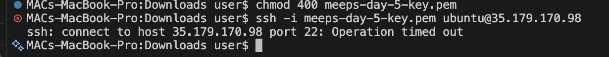
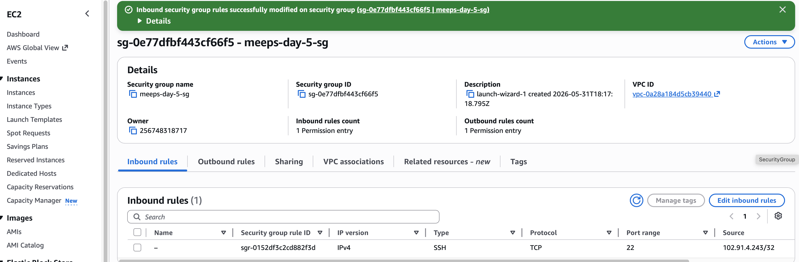
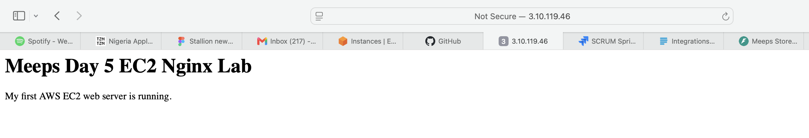

# Week 1: Cloud Foundations

## What I Learned

This week, I learned the basic foundations of cloud and platform engineering. I focused on understanding what cloud solves, how infrastructure works, basic Linux commands, networking concepts, AWS IAM security, and how to launch a basic EC2 server.

## Topics Covered

- Cloud engineering basics
- Platform engineering basics
- Linux terminal commands
- Networking fundamentals
- DNS, ports, HTTPS, firewalls, and load balancers
- AWS account setup
- IAM users, groups, roles, and policies
- MFA and least privilege
- EC2 fundamentals
- SSH access from Mac to AWS EC2
- Installing and running Nginx on Ubuntu EC2
- Security group inbound rules

## Labs Completed

### Day 2: Linux Basics

- Created a local project folder from the terminal.
- Created markdown files using `touch`.
- Practiced basic Linux commands like `pwd`, `ls`, `cd`, `mkdir`, `cat`, `cp`, `mv`, and `rm`.

### Day 3: Networking Basics

- Documented what happens when a user visits a backend API from the browser.
- Created a simple request flow:

```text
User → Browser → DNS → Internet → Load Balancer → Server → Application → Database → Response
```

### Day 4: AWS IAM Setup

- Created an AWS account.
- Enabled MFA on the root account.
- Created an IAM admin user.
- Installed and configured AWS CLI locally.
- Verified AWS CLI identity using:

```bash
aws sts get-caller-identity
```

### Day 5: EC2 and Nginx Lab

- Launched an Ubuntu EC2 instance.
- Created and used a `.pem` key pair.
- Connected to the EC2 instance from my Mac using SSH.
- Installed Nginx.
- Opened HTTP port `80`.
- Visited the EC2 public IP from my browser.
- Served a custom web page from the EC2 instance.

## Problems I Faced

During the EC2 lab, I tried to SSH into my EC2 server from my Mac, but the connection failed with:

```text
Operation timed out
```

The issue was related to port `22`. My EC2 security group did not have the correct inbound SSH rule.

## How I Solved Them

I went back to the EC2 security group and edited the inbound rules.

I added an inbound rule for SSH:

```text
Type: SSH
Protocol: TCP
Port: 22
Source: My public IP
```

After saving the rule, I retried the SSH connection from my Mac and successfully connected to the EC2 instance.

## Key Takeaways

- Cloud engineering is about solving infrastructure problems, not just using AWS services.
- Linux is important because most cloud servers run on Linux.
- Networking is required to understand how users reach applications.
- IAM is the foundation of AWS security.
- The root AWS account should not be used for daily work.
- MFA should be enabled before deploying anything.
- Security groups act like firewalls for EC2 instances.
- SSH uses port `22`.
- HTTP uses port `80`.
- A missing inbound rule can block access to a server.
- EC2 allows me to create and manage virtual servers in the cloud.

## Screenshots

### Security group before fixing SSH



### Security group after allowing SSH from my public IP



### Nginx running on EC2



## Why This Matters

This week gave me the foundation needed to understand real cloud infrastructure. Before learning advanced AWS services, I need to understand servers, networking, access control, firewalls, SSH, and basic deployment.

## What I Would Do Differently Next Time

- Check my security group inbound rules before trying to SSH.
- Confirm that port `22` is open only to my own IP.
- Name screenshots clearly before uploading them to GitHub.
- Document errors immediately while solving them.
- Terminate unused EC2 instances after labs to avoid unnecessary cost.

## Next Week Focus

Next week, I will focus on AWS networking.

Topics will include:

- VPC
- Subnets
- Route tables
- Internet Gateway
- NAT Gateway
- Public and private subnets
- Security groups
- Network ACLs
- EC2 networking patterns
