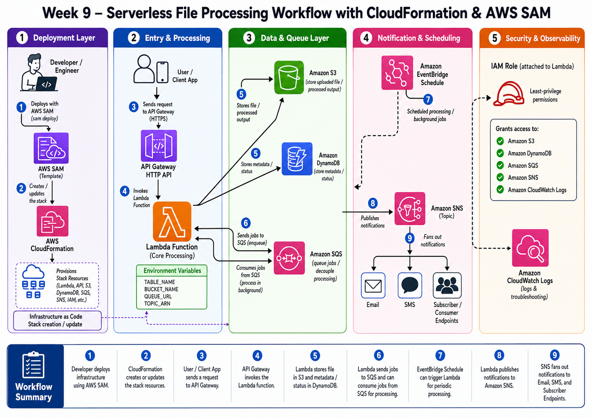

# Week 9 — Serverless File-Processing Platform with AWS CloudFormation and AWS SAM

## Project Overview

This project implements a production-style, event-driven serverless workflow using AWS CloudFormation and AWS SAM.

The objective was to rebuild infrastructure that had previously been created manually and manage it as repeatable, version-controlled Infrastructure as Code.

The platform accepts API requests, reacts to S3 uploads, creates background jobs, stores metadata in DynamoDB, processes messages through SQS, runs scheduled workloads through EventBridge, publishes completion notifications through SNS, and records application activity in CloudWatch Logs.

The final implementation is divided into nested CloudFormation/SAM stacks to improve maintainability, separation of responsibility, and infrastructure reuse.

---

## Architecture



### High-Level Flow

```text
Developer
   |
   v
AWS SAM
   |
   v
CloudFormation Root Stack
   |
   +--> Storage Nested Stack
   |      +--> Amazon S3
   |      +--> Amazon DynamoDB
   |
   +--> Messaging Nested Stack
   |      +--> Amazon SQS
   |      +--> SQS Dead-Letter Queue
   |      +--> Amazon SNS
   |
   +--> IAM Nested Stack
   |      +--> Lambda Execution Role
   |      +--> Least-Privilege Policies
   |
   +--> Serverless Nested Stack
          +--> API Gateway
          +--> AWS Lambda
          +--> EventBridge Rule
          +--> EventBridge Scheduler
          +--> CloudWatch Logs
```

---

## Event-Driven Workflows

### 1. API Job Processing

```text
Client / Postman
   -> API Gateway
   -> Lambda
   -> DynamoDB
   -> SQS
   -> Lambda SQS Consumer
   -> DynamoDB Status Update
   -> SNS Notification
   -> Email Subscriber
```

### 2. S3 Upload Processing

```text
File uploaded to S3 uploads/ prefix
   -> Amazon EventBridge
   -> Lambda
   -> Extract bucket and object metadata
   -> Store metadata in DynamoDB
   -> Send processing job to SQS
   -> Lambda consumes the message
   -> Update processing status
   -> Publish completion notification to SNS
```

### 3. Scheduled Processing

```text
EventBridge Scheduler
   -> Lambda
   -> Store scheduled job in DynamoDB
   -> Send job to SQS
   -> Lambda processes the job
   -> Publish notification through SNS
```

### 4. Failed Message Handling

```text
SQS Message
   -> Lambda processing failure
   -> Automatic retry
   -> Maximum receive count reached
   -> Message moved to SQS Dead-Letter Queue
```

---

## AWS Services Used

| Service                | Purpose                                                       |
| ---------------------- | ------------------------------------------------------------- |
| AWS CloudFormation     | Provisions and manages infrastructure as stacks               |
| AWS SAM                | Defines and deploys serverless resources                      |
| AWS Lambda             | Processes API, S3, SQS, and scheduled events                  |
| Amazon API Gateway     | Exposes REST API endpoints                                    |
| Amazon S3              | Stores uploaded files and generates object-created events     |
| Amazon DynamoDB        | Stores file metadata, jobs, processing status, and TTL values |
| Amazon EventBridge     | Routes S3 object-created events to Lambda                     |
| EventBridge Scheduler  | Invokes Lambda for periodic background jobs                   |
| Amazon SQS             | Decouples job producers from background processing            |
| SQS Dead-Letter Queue  | Stores messages that fail repeatedly                          |
| Amazon SNS             | Publishes job-completion notifications                        |
| AWS IAM                | Provides least-privilege Lambda permissions                   |
| Amazon CloudWatch Logs | Stores application and Lambda execution logs                  |

> The current API implementation uses `AWS::Serverless::Api`, which creates an API Gateway REST API.

---

## Project Objectives

- Manage AWS infrastructure through code instead of manual console configuration.
- Build reusable and repeatable serverless environments.
- Understand CloudFormation templates, parameters, outputs, conditions, and intrinsic functions.
- Deploy Lambda applications with AWS SAM.
- Build event-driven integrations between S3, EventBridge, Lambda, SQS, SNS, and DynamoDB.
- Use nested stacks to separate infrastructure responsibilities.
- Apply least-privilege IAM permissions.
- Review infrastructure changes before deployment.
- Test CloudFormation rollback behavior.
- Detect and correct infrastructure drift.
- Use CloudWatch Logs and stack events for troubleshooting.

---

## Key Features

- Infrastructure provisioned entirely through CloudFormation and AWS SAM.
- Root stack coordinating multiple nested stacks.
- S3 public access blocked.
- S3 server-side encryption enabled.
- DynamoDB encryption enabled.
- DynamoDB on-demand billing enabled.
- DynamoDB TTL configured using the `expiresAt` attribute.
- API Gateway routes connected to Lambda.
- S3 uploads routed through EventBridge.
- Scheduled background processing through EventBridge Scheduler.
- SQS processing queue with a dead-letter queue.
- Partial SQS batch failure reporting.
- Optional SNS email subscription.
- Least-privilege Lambda execution role.
- CloudWatch log retention configured.
- Resource tags applied consistently.
- Change sets reviewed before stack updates.
- Rollback and drift detection tested.

---

## API Endpoints

| Method | Endpoint            | Purpose                                        |
| ------ | ------------------- | ---------------------------------------------- |
| `GET`  | `/health`           | Returns service health information             |
| `GET`  | `/deployment`       | Returns the deployed application version       |
| `POST` | `/metadata`         | Creates a metadata item directly               |
| `GET`  | `/metadata?id=<id>` | Retrieves a metadata item                      |
| `POST` | `/jobs`             | Creates and queues a background processing job |

---

## Repository Structure

```text
cloudformation-aws-sam-lambda-file-processor/
├── apps/
│   └── lambda-file-processor/
│       ├── src/
│       │   ├── app.py
│       │   └── app-day63-before-nested.py
│       └── requirements.txt
│
├── infra/
│   └── cloudformation/
│       ├── serverless-sam/
│       │   ├── template.yaml
│       │   ├── samconfig.toml
│       │   ├── events/
│       │   └── template-day*.yaml
│       │
│       └── nested-serverless/
│           ├── root.yaml
│           ├── storage.yaml
│           ├── messaging.yaml
│           ├── iam.yaml
│           ├── serverless.yaml
│           └── packaged-root.yaml
│
└── ├── Architecture/
    │   └── CloudFormation-AWS-SAM.png
    ├── screenshots/
    └── README.md
```

### Implementation Directories

- `serverless-sam/` contains the incremental single-stack implementation developed during Days 59–62.
- `nested-serverless/` contains the final modular implementation created during Day 63.
- `apps/lambda-file-processor/` contains the Lambda application code used by the serverless stack.

---

## Week 9 Implementation Journey

| Day    | Work Completed                                                                                                 |
| ------ | -------------------------------------------------------------------------------------------------------------- |
| Day 57 | Created the first CloudFormation S3 stack with parameters, tags, and outputs                                   |
| Day 58 | Created a least-privilege Lambda IAM role through CloudFormation                                               |
| Day 59 | Installed AWS SAM CLI and deployed the first Lambda application                                                |
| Day 60 | Added API Gateway, DynamoDB, environment variables, and IAM permissions                                        |
| Day 61 | Added an S3 upload trigger and event-driven file metadata processing                                           |
| Day 62 | Created change sets, tested failed updates, rollback, DynamoDB TTL, and a deployment endpoint                  |
| Day 63 | Performed drift detection and refactored the solution into nested stacks with EventBridge, SQS, SNS, and a DLQ |

---

## CloudFormation Concepts Demonstrated

### Parameters

Parameters make the templates reusable across environments.

Examples:

- `ProjectName`
- `EnvironmentName`
- `OwnerName`
- `NotificationEmail`
- `ScheduleExpression`
- `ScheduleState`
- `DeploymentVersion`

### Outputs

Outputs expose important deployed resource values.

Examples:

- API Gateway URL
- S3 bucket name
- DynamoDB table name
- SQS queue URL
- SNS topic ARN
- Lambda function name
- EventBridge rule name

### Intrinsic Functions

The project uses:

- `!Ref`
- `!GetAtt`
- `!Sub`
- `!Join`
- `!Equals`
- `!Not`

### Change Sets

Change sets were used to preview:

- Added resources
- Modified resources
- Deleted resources
- Resource replacement behavior

### Stack Events

CloudFormation stack events were used to identify:

- The first failed resource
- Validation failures
- IAM capability errors
- Invalid S3 configuration
- Rollback progress
- Final successful deployment status

### Drift Detection

Drift detection was tested by manually changing an S3 resource tag.

CloudFormation detected that the deployed bucket no longer matched the template. The manual change was reverted, and the stack returned to `IN_SYNC`.

---

## Nested Stack Design

### Root Stack

The root stack coordinates all child stacks and passes parameters and outputs between them.

```text
root.yaml
```

### Storage Stack

```text
storage.yaml
```

Creates:

- S3 upload bucket
- DynamoDB metadata table
- S3 EventBridge integration
- DynamoDB TTL
- Encryption and resource tags

### Messaging Stack

```text
messaging.yaml
```

Creates:

- SQS processing queue
- SQS dead-letter queue
- SNS notification topic
- Optional email subscription

### IAM Stack

```text
iam.yaml
```

Creates:

- Lambda execution role
- CloudWatch Logs permissions
- S3 read permissions
- DynamoDB read/write permissions
- SQS producer and consumer permissions
- SNS publish permission

### Serverless Stack

```text
serverless.yaml
```

Creates:

- API Gateway
- Lambda function
- API routes
- SQS event source mapping
- EventBridge S3 rule
- EventBridge Scheduler schedule
- CloudWatch log group

---

## Prerequisites

Before deployment, install and configure:

- AWS CLI
- AWS SAM CLI
- Python 3.13
- Git
- An AWS account
- AWS credentials with permission to deploy the required resources
- Postman or `curl` for API testing

Verify the tools:

```bash
aws --version
sam --version
python3 --version
```

Confirm the active AWS identity:

```bash
aws sts get-caller-identity
```

Confirm the configured Region:

```bash
aws configure get region
```

---

## Validate the Application

Move into the final nested-stack directory:

```bash
cd infra/cloudformation/nested-serverless
```

Validate the Lambda code:

```bash
python3 -m py_compile \
  ../../../apps/lambda-file-processor/src/app.py
```

Validate the root SAM template:

```bash
sam validate \
  --template-file root.yaml \
  --lint
```

Validate the child SAM template:

```bash
sam validate \
  --template-file serverless.yaml \
  --lint
```

Validate the CloudFormation child templates:

```bash
aws cloudformation validate-template \
  --template-body file://storage.yaml

aws cloudformation validate-template \
  --template-body file://messaging.yaml

aws cloudformation validate-template \
  --template-body file://iam.yaml
```

---

## Build and Package

Remove previous generated artifacts:

```bash
rm -rf .aws-sam
rm -f packaged-root.yaml
```

Build the application:

```bash
sam build \
  --template-file root.yaml \
  --no-cached
```

Package the application and nested templates:

```bash
REGION=$(aws configure get region)

sam package \
  --template-file .aws-sam/build/template.yaml \
  --resolve-s3 \
  --output-template-file packaged-root.yaml \
  --region "$REGION"
```

Confirm the packaged template exists:

```bash
ls -lh packaged-root.yaml
```

Generated files such as `.aws-sam/` and `packaged-*.yaml` should be treated as deployment artifacts rather than source files.

---

## Deploy the Nested Application

```bash
sam deploy \
  --guided \
  --template-file packaged-root.yaml \
  --capabilities CAPABILITY_IAM CAPABILITY_AUTO_EXPAND
```

Recommended parameter values:

| Parameter          | Example                           |
| ------------------ | --------------------------------- |
| Stack name         | `meeps-week9-nested-serverless`   |
| ProjectName        | `meeps-nested`                    |
| EnvironmentName    | `dev`                             |
| OwnerName          | `meeps`                           |
| NotificationEmail  | Your email address or leave empty |
| ScheduleExpression | `rate(5 minutes)`                 |
| ScheduleState      | `ENABLED`                         |
| DeploymentVersion  | `day63-nested-v1`                 |

Recommended deployment options:

```text
Confirm changes before deploy: Y
Allow SAM CLI IAM role creation: Y
Disable rollback: N
Save arguments to samconfig.toml: Y
```

The deployment requires:

```text
CAPABILITY_IAM
CAPABILITY_AUTO_EXPAND
```

`CAPABILITY_IAM` permits CloudFormation to create IAM resources.

`CAPABILITY_AUTO_EXPAND` permits CloudFormation to expand nested SAM applications.

---

## Retrieve Stack Outputs

```bash
STACK_NAME="meeps-week9-nested-serverless"
```

Retrieve the API URL:

```bash
API_URL=$(aws cloudformation describe-stacks \
  --stack-name "$STACK_NAME" \
  --query "Stacks[0].Outputs[?OutputKey=='ApiBaseUrl'].OutputValue" \
  --output text)
```

Retrieve the upload bucket:

```bash
UPLOAD_BUCKET=$(aws cloudformation describe-stacks \
  --stack-name "$STACK_NAME" \
  --query "Stacks[0].Outputs[?OutputKey=='UploadBucketName'].OutputValue" \
  --output text)
```

Retrieve the DynamoDB table:

```bash
TABLE_NAME=$(aws cloudformation describe-stacks \
  --stack-name "$STACK_NAME" \
  --query "Stacks[0].Outputs[?OutputKey=='MetadataTableName'].OutputValue" \
  --output text)
```

Retrieve the SQS queue:

```bash
QUEUE_URL=$(aws cloudformation describe-stacks \
  --stack-name "$STACK_NAME" \
  --query "Stacks[0].Outputs[?OutputKey=='ProcessingQueueUrl'].OutputValue" \
  --output text)
```

Retrieve the Lambda function:

```bash
FUNCTION_NAME=$(aws cloudformation describe-stacks \
  --stack-name "$STACK_NAME" \
  --query "Stacks[0].Outputs[?OutputKey=='LambdaFunctionName'].OutputValue" \
  --output text)
```

Display the values:

```bash
printf 'API URL: %s\n' "$API_URL"
printf 'Upload Bucket: %s\n' "$UPLOAD_BUCKET"
printf 'DynamoDB Table: %s\n' "$TABLE_NAME"
printf 'SQS Queue: %s\n' "$QUEUE_URL"
printf 'Lambda Function: %s\n' "$FUNCTION_NAME"
```

---

## API Testing

### Health Check

```bash
curl -sS "$API_URL/health" | python3 -m json.tool
```

Expected response:

```json
{
  "status": "healthy",
  "service": "meeps-file-processor",
  "environment": "dev"
}
```

### Deployment Information

```bash
curl -sS "$API_URL/deployment" | python3 -m json.tool
```

Expected response:

```json
{
  "service": "meeps-file-processor",
  "deploymentVersion": "day63-nested-v1",
  "environment": "dev"
}
```

### Create Metadata

```bash
curl -sS \
  -X POST \
  "$API_URL/metadata" \
  -H "Content-Type: application/json" \
  -d '{
    "fileName": "week9-document.txt"
  }' \
  | python3 -m json.tool
```

### Retrieve Metadata

```bash
curl -sS \
  "$API_URL/metadata?id=<metadata-id>" \
  | python3 -m json.tool
```

### Queue a Background Job

```bash
curl -sS \
  -X POST \
  "$API_URL/jobs" \
  -H "Content-Type: application/json" \
  -d '{
    "jobType": "manual-file-processing",
    "fileName": "day63-job.txt"
  }' \
  | python3 -m json.tool
```

Expected HTTP status:

```text
202 Accepted
```

---

## Test the S3 Workflow

Create a test file:

```bash
echo "Meeps Week 9 nested serverless test" \
  > /tmp/week9-s3-test.txt
```

Upload it under the monitored `uploads/` prefix:

```bash
aws s3 cp \
  /tmp/week9-s3-test.txt \
  "s3://$UPLOAD_BUCKET/uploads/week9-s3-test.txt" \
  --content-type text/plain
```

Expected flow:

```text
S3
-> EventBridge
-> Lambda
-> DynamoDB
-> SQS
-> Lambda
-> SNS
```

Allow several minutes after the first deployment for S3 EventBridge delivery to become active.

---

## Check CloudWatch Logs

```bash
aws logs tail \
  "/aws/lambda/$FUNCTION_NAME" \
  --since 20m \
  --format short
```

Expected structured log messages include:

```text
event_received
s3_event_processed
job_queued
sqs_job_completed
scheduled_job_queued
```

---

## Check DynamoDB Records

```bash
aws dynamodb scan \
  --table-name "$TABLE_NAME" \
  --query "Items[*].{
    Id:id.S,
    Source:sourceType.S,
    Status:processingStatus.S,
    Bucket:bucket.S,
    ObjectKey:objectKey.S
  }" \
  --output table
```

Expected records may include:

- API metadata records
- API-created jobs
- S3 object metadata
- Scheduled jobs
- Completed processing status

---

## Check SQS

```bash
aws sqs get-queue-attributes \
  --queue-url "$QUEUE_URL" \
  --attribute-names \
    ApproximateNumberOfMessages \
    ApproximateNumberOfMessagesNotVisible \
  --output table
```

### Test the Dead-Letter Queue

Send an invalid message:

```bash
aws sqs send-message \
  --queue-url "$QUEUE_URL" \
  --message-body "this-is-not-valid-json"
```

The Lambda consumer will fail to parse the message. After the configured retry limit is reached, SQS moves it to the dead-letter queue.

---

## SNS Notification Setup

When an email address is supplied during deployment, AWS sends a subscription-confirmation message.

The recipient must select:

```text
Confirm subscription
```

Until the subscription is confirmed, SNS will not deliver notification emails.

---

## Change Set Workflow

The project used CloudFormation change sets before stack updates.

```text
Edit source
-> Validate
-> Build
-> Verify build artifacts
-> Package
-> Create change set
-> Review planned changes
-> Execute
-> Monitor stack events
```

Change sets were reviewed for:

- Unexpected resource deletion
- Resource replacement
- IAM modifications
- New infrastructure
- API deployment changes
- Lambda code updates

A change set was executed only after reaching:

```text
Status: CREATE_COMPLETE
ExecutionStatus: AVAILABLE
```

---

## Rollback Testing

A stack update was intentionally broken to observe CloudFormation rollback behavior.

The expected status progression was:

```text
UPDATE_IN_PROGRESS
UPDATE_ROLLBACK_IN_PROGRESS
UPDATE_ROLLBACK_COMPLETE
```

The failed resource was identified through:

```text
CloudFormation
-> Stack
-> Events
-> First CREATE_FAILED or UPDATE_FAILED resource
-> ResourceStatusReason
```

After fixing the template, the application was rebuilt, repackaged, and deployed successfully.

Final healthy status:

```text
UPDATE_COMPLETE
```

---

## Drift Detection

A safe manual change was made to an S3 bucket tag.

The expected template value was:

```text
day = day-62
```

The manually changed value was:

```text
day = day-63-manual-drift
```

CloudFormation detected:

```text
Stack drift status: DRIFTED
Resource drift status: MODIFIED
```

The manual tag was restored to match the template, and drift detection was run again.

Final result:

```text
IN_SYNC
```

This demonstrated why production resources should not be changed manually without updating the Infrastructure as Code source.

---

## Security Decisions

- No `AdministratorAccess` policy was attached.
- No AWS access keys were stored in Lambda code.
- Lambda uses an execution role.
- S3 public access is blocked.
- S3 encryption is enabled.
- DynamoDB encryption is enabled.
- SQS server-side encryption is enabled.
- IAM permissions are resource-scoped wherever supported.
- Lambda can read only from the required S3 upload prefix.
- Lambda can access only the project DynamoDB table.
- Lambda can send and consume messages only from the processing queue.
- Lambda can publish only to the configured SNS topic.
- CloudWatch log retention is limited.
- Environment-specific values are passed through parameters and environment variables.
- Resource tags identify the project, week, owner, and environment.

---

## Reliability Decisions

- SQS decouples event producers from background processing.
- Failed messages are retried automatically.
- A dead-letter queue stores repeatedly failing messages.
- Partial batch response reporting prevents successful SQS records from being retried.
- DynamoDB TTL automatically expires old metadata.
- EventBridge Scheduler handles recurring tasks without servers.
- CloudFormation rollback protects the previous working stack.
- Drift detection identifies unauthorized manual changes.
- Change sets provide a deployment preview before infrastructure updates.

---

## Cost-Control Decisions

- DynamoDB uses `PAY_PER_REQUEST`.
- Lambda memory is kept small for the lab.
- Lambda timeout is limited.
- CloudWatch Logs use a short retention period.
- S3 resources are private and used only for project files.
- EventBridge schedules should be disabled after testing.
- Test files and messages should be removed after documentation.
- The complete stack should be deleted when the lab is finished.
- AWS Budgets should remain enabled to detect unexpected charges.

Disable the schedule after testing by updating:

```text
ScheduleState = DISABLED
```

---

## Challenges Faced and How They Were Fixed

| Challenge                                            | Root Cause                                                                          | Fix                                                                                                |
| ---------------------------------------------------- | ----------------------------------------------------------------------------------- | -------------------------------------------------------------------------------------------------- |
| `zsh: command not found: sam`                        | AWS SAM CLI was not installed or not available in `PATH`                            | Installed AWS SAM CLI, refreshed the shell, and verified with `sam --version`                      |
| `sam build` could not find Python 3.13               | The template runtime did not match the locally installed Python version             | Installed Python 3.13 and added it to the terminal `PATH`                                          |
| `sam build --use-container` failed                   | Docker or Finch was not installed and running                                       | Used the matching local Python runtime instead of a container build                                |
| Invalid S3 bucket name                               | Folded YAML syntax such as `!Sub >` introduced invalid formatting or whitespace     | Replaced folded values with quoted single-line `!Sub` strings                                      |
| Lambda source directory was not found                | `CodeUri` was incorrect after the SAM template was moved deeper into the repository | Corrected the path to `../../../apps/lambda-file-processor/`                                       |
| SAM build skipped copying Lambda code                | The resolved `CodeUri` directory did not exist                                      | Verified the source path before building and inspected `.aws-sam/build/FileProcessorFunction/`     |
| SAM packaging failed                                 | The Lambda artifact was missing from the build directory                            | Deleted `.aws-sam`, rebuilt without cache, verified the artifact, and packaged again               |
| `/deployment` returned `Route not found`             | An older Lambda build artifact had been deployed                                    | Removed stale build files, verified the route in the built `app.py`, repackaged, and redeployed    |
| Change set status was `FAILED`                       | The submitted packaged template contained no valid changes or was stale             | Inspected `StatusReason`, regenerated the package, and added a unique deployment-version parameter |
| `"null" values are not allowed in templates`         | Incorrect YAML indentation nested one output inside another                         | Corrected the `Outputs` structure and ensured every output had a valid `Value`                     |
| Packaged files were deleted manually                 | Generated deployment artifacts were removed before reuse                            | Rebuilt the application and regenerated the packaged template from source                          |
| Stack update rolled back                             | A resource failed during creation or update                                         | Checked stack events, found the first failed resource, fixed the template, and redeployed          |
| IAM resource deployment failed                       | CloudFormation capabilities were not acknowledged                                   | Deployed with `CAPABILITY_IAM`                                                                     |
| Nested SAM deployment required additional capability | CloudFormation needed permission to expand nested applications                      | Added `CAPABILITY_AUTO_EXPAND`                                                                     |
| Manual S3 change created drift                       | The deployed resource no longer matched the template                                | Ran drift detection, reviewed the property difference, and restored the template-defined value     |
| SNS email was not received                           | The email subscription had not been confirmed                                       | Opened the AWS confirmation email and confirmed the subscription                                   |

---

## What I Intentionally Broke

To improve troubleshooting skills, several failures were created deliberately:

- Removed or restricted IAM permissions.
- Created a failed CloudFormation stack update.
- Triggered automatic rollback.
- Submitted a change set containing an invalid configuration.
- Created an invalid or conflicting resource definition.
- Changed an S3 tag manually to create drift.
- Sent invalid JSON to SQS to test retry and dead-letter behavior.
- Deployed stale Lambda code to understand SAM build and packaging behavior.

Each failure was investigated using:

- CloudFormation stack events
- Change set `StatusReason`
- Lambda CloudWatch Logs
- SAM build output
- Packaged template inspection
- IAM policy inspection
- SQS queue and DLQ attributes
- CloudFormation drift results

---

## CloudFormation vs Terraform

| CloudFormation                                      | Terraform                                                       |
| --------------------------------------------------- | --------------------------------------------------------------- |
| AWS-native Infrastructure as Code                   | Multi-provider Infrastructure as Code                           |
| Uses CloudFormation stacks                          | Uses Terraform state                                            |
| Uses change sets                                    | Uses `terraform plan`                                           |
| Rollback is managed by AWS                          | Recovery depends on state and provider behavior                 |
| Drift detection is available through AWS            | Drift is identified through refresh and plan                    |
| Deep integration with AWS services                  | Consistent workflow across multiple providers                   |
| SAM extends CloudFormation for serverless workloads | Serverless resources are defined through AWS provider resources |

CloudFormation was learned first to understand AWS-native infrastructure behavior before moving to Terraform.

---

## Troubleshooting Workflow

The troubleshooting process used throughout the project was:

```text
1. Check the current stack status
2. Read the first failed stack event
3. Inspect ResourceStatusReason
4. Validate the source template
5. Verify CodeUri and local source paths
6. Delete stale .aws-sam artifacts
7. Rebuild with --no-cached
8. Inspect the built Lambda code
9. Regenerate the packaged template
10. Review the change set
11. Execute only when the change set is available
12. Monitor stack events until UPDATE_COMPLETE
13. Test the API or event source
14. Confirm results in CloudWatch and DynamoDB
```

---

## Generated Files

The following files should not be treated as source files:

```text
.aws-sam/
packaged-*.yaml
response.json
__pycache__/
*.pyc
```

Suggested `.gitignore` entries:

```gitignore
.aws-sam/
packaged-*.yaml
response.json
__pycache__/
*.py[cod]
.DS_Store
```

`samconfig.toml` may be committed only when it contains no credentials or sensitive data.

---

## Cleanup

Before deleting the stack, retrieve and empty the S3 upload bucket:

```bash
STACK_NAME="meeps-week9-nested-serverless"

UPLOAD_BUCKET=$(aws cloudformation describe-stacks \
  --stack-name "$STACK_NAME" \
  --query "Stacks[0].Outputs[?OutputKey=='UploadBucketName'].OutputValue" \
  --output text)
```

Delete test objects:

```bash
aws s3 rm \
  "s3://$UPLOAD_BUCKET" \
  --recursive
```

Delete the root stack and its nested stacks:

```bash
sam delete \
  --stack-name "$STACK_NAME"
```

Deleting the root stack also initiates deletion of:

- Storage nested stack
- Messaging nested stack
- IAM nested stack
- Serverless nested stack

Do not delete the shared `aws-sam-cli-managed-default` artifact bucket without confirming that no other SAM applications use it.

---

## Evidence Captured

The project documentation includes screenshots of:

- CloudFormation root stack
- Nested stack hierarchy
- Successful stack creation and updates
- CloudFormation change sets
- Failed update and rollback events
- Drift detection showing `DRIFTED`
- Corrected drift showing `IN_SYNC`
- API Gateway routes
- Lambda function configuration
- Lambda environment variables
- S3 upload bucket
- S3 EventBridge configuration
- EventBridge rule
- EventBridge Scheduler schedule
- DynamoDB table and processed items
- SQS processing queue
- SQS dead-letter queue
- SNS topic and confirmed subscription
- Least-privilege IAM role
- CloudWatch application logs
- Successful API responses
- SNS notification email

---

## Production Improvements

For a production implementation, I would add:

- Separate Lambda functions for API, S3, scheduled, and SQS responsibilities.
- API authentication using Amazon Cognito or JWT authorizers.
- API throttling and AWS WAF.
- Lambda reserved concurrency and failure alarms.
- CloudWatch dashboards and alarms.
- EventBridge retry policies and dead-letter queues.
- SNS filter policies.
- AWS KMS customer-managed keys.
- Idempotency controls for duplicate events.
- DynamoDB conditional writes.
- Automated unit and integration tests.
- AWS Lambda Powertools for logging, tracing, metrics, and idempotency.
- GitHub Actions deployment using AWS OIDC.
- Separate development, staging, and production environments.
- Secrets Manager or SSM Parameter Store for sensitive configuration.
- X-Ray distributed tracing.
- CloudTrail and AWS Config monitoring.
- Cost and security review automation.

---

## Skills Demonstrated

- AWS Cloud Engineering
- Serverless Architecture
- Infrastructure as Code
- AWS CloudFormation
- AWS SAM
- Nested Stacks
- Event-Driven Architecture
- AWS Lambda
- Amazon API Gateway
- Amazon S3
- Amazon DynamoDB
- Amazon EventBridge
- Amazon SQS
- Amazon SNS
- AWS IAM
- Least-Privilege Security
- CloudWatch Logging
- Change Sets
- Rollback Testing
- Drift Detection
- YAML
- Python
- AWS CLI
- Production Troubleshooting
- Cost-Aware Architecture
- Technical Documentation

---

## Final Outcome

This project demonstrates the ability to move from manually created AWS resources to a modular, repeatable, event-driven serverless platform managed through Infrastructure as Code.

It also demonstrates practical experience with safe infrastructure updates, failed deployment recovery, rollback analysis, IAM troubleshooting, drift detection, asynchronous processing, dead-letter queues, scheduled workloads, notifications, observability, and nested-stack architecture.
